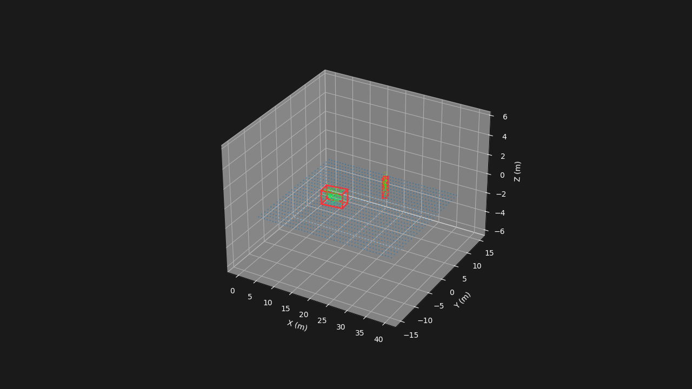

# pcd-detect

Classical 3D point cloud detection baseline for KITTI Odometry /
SemanticKITTI-style LiDAR scans.

This project does not train a neural model. It implements a transparent point
cloud processing pipeline: ROI crop, voxel downsampling, RANSAC ground removal,
DBSCAN or BEV connected-component proposals, PCA-based oriented boxes, static
visualization, video export, and detection-oriented evaluation.

## Why This Project Exists

The goal is to make a small but reproducible LiDAR perception project that can
be inspected end to end. It is useful for discussing point cloud data loading,
geometric preprocessing, proposal generation, box fitting, evaluation protocol,
runtime tradeoffs, and failure modes of non-learning methods.

## Features

- KITTI Odometry / SemanticKITTI dataset reader
- SemanticKITTI label parsing with semantic and instance id splitting
- ROI crop, fixed or distance-adaptive voxel downsampling
- RANSAC ground segmentation
- DBSCAN and BEV connected-component proposal generators
- PCA-based oriented bounding boxes
- JSONL box export, PNG rendering, video export, and evaluation helpers
- Tiny committed SemanticKITTI-style fixture for CI and smoke tests

## Quick Start

```bash
uv sync --group dev --extra viz
uv run pcd-detect --help
```

Run the committed mini fixture. This checks that the pipeline is executable
without downloading KITTI; it is not meant to represent real performance.

```bash
uv run python tools/check_dataset.py \
  --dataset examples/mini_semkitti \
  --sequence 00 \
  --sample 2

uv run pcd-detect run \
  --config examples/mini_config.yaml \
  --frames 0-2

uv run pcd-detect eval \
  --config examples/mini_config.yaml

uv run pcd-detect viz \
  --config examples/mini_config.yaml \
  --output docs/assets/pcd-detect-mini.png
```

Expected generated output:

```text
outputs/mini/
  boxes/00/boxes.jsonl
  reports/det_metrics.json
```



## KITTI Subset Result

The repository includes a reproducible configuration for a real validation
subset: SemanticKITTI sequence 08, frames 0-499. The commands below assume that
`data` points to a KITTI/SemanticKITTI dataset root containing `sequences/`.

```bash
ln -s /path/to/kitti/dataset data

uv run python tools/check_dataset.py \
  --dataset ./data \
  --sequence 08 \
  --sample 20

uv run pcd-detect run --config examples/kitti08_subset.yaml
uv run pcd-detect eval --config examples/kitti08_subset.yaml

uv run python tools/render_bev.py \
  --config examples/kitti08_qualitative.yaml \
  --frame 30 \
  --mode pipeline \
  --output docs/assets/kitti08-frame-000030-pipeline.png

uv run python tools/render_bev.py \
  --config examples/kitti08_qualitative.yaml \
  --frame 120 \
  --mode pipeline \
  --output docs/assets/kitti08-frame-000120-pipeline.png

uv run python tools/render_bev.py \
  --config examples/kitti08_qualitative.yaml \
  --frame 450 \
  --mode pipeline \
  --output docs/assets/kitti08-frame-000450-pipeline.png
```

Subset metrics, generated from `outputs/kitti08_subset/reports/det_metrics.json`:

| Sequence / frames | Targets | IoU | Precision | Recall | F1 | Mean IoU |
| --- | --- | --- | ---: | ---: | ---: | ---: |
| 08 / 0-499 | car, person | BEV >= 0.5 | 0.0379 | 0.2907 | 0.0670 | 0.7223 |

Distance-stratified recall:

| Range | Precision | Recall | F1 |
| --- | ---: | ---: | ---: |
| 0-10m | 0.269 | 0.810 | 0.404 |
| 10-20m | 0.067 | 0.420 | 0.116 |
| 20-30m | 0.014 | 0.117 | 0.025 |
| 30-40m | 0.005 | 0.055 | 0.009 |
| 40-50m | 0.005 | 0.040 | 0.009 |

These numbers should be read as proposal-baseline results, not as detector
model accuracy. The pipeline creates many geometric proposals and uses simple
box-size heuristics for semantic class assignment, so false positives are high.
When a proposal does match a ground-truth object, box geometry is often
reasonable, which is reflected in the matched-box mean IoU.

The qualitative configuration uses the exact same processing parameters as the
subset run. Its `visualization.display_roi` only crops the rendered view for
readability. Panel 3 is label-backed: predictions are matched to real
SemanticKITTI instances with the same class-aware BEV-IoU rule as evaluation;
green, red, and dashed orange boxes are TP, FP, and FN respectively. The images
are diagnostics, not a replacement for the subset metrics above.


More details: [docs/results/kitti08_subset.md](docs/results/kitti08_subset.md).

## Configuration

Default modular configs live in `configs/`:

- `base.yaml`: dataset, output, logging
- `detection.yaml`: ROI, voxel, ground, proposals, filtering, boxes
- `visualization.yaml`: view mode, frame, camera
- `evaluation.yaml`: detection and optional SemanticKITTI metrics
- `export.yaml`: video and prediction export

Passing `--config path/to/file.yaml` loads a single YAML file. The mini fixture
uses `examples/mini_config.yaml`; the real subset uses
`examples/kitti08_subset.yaml`.

Machine-specific overrides for the modular default configs can be placed in
`configs/config.local.yaml`, which is ignored by Git. For explicit example
configs, prefer the `data` symlink shown above.

## Output Contract

Detection boxes:

```text
outputs/<run-name>/boxes/<sequence>/boxes.jsonl
```

Predictions exported to SemanticKITTI format:

```text
outputs/<run-name>/predictions/sequences/<sequence>/predictions/*.label
```

Reports and videos:

```text
outputs/<run-name>/reports/
outputs/<run-name>/videos/
```

## Official SemanticKITTI Tools

The official SemanticKITTI API is optional and is not vendored. Clone it only
when you need official visualization or semantic IoU evaluation:

```bash
mkdir -p third_party
git clone https://github.com/PRBonn/semantic-kitti-api.git third_party/semkitti_api
```

The box-to-label export path is approximate: points inside valid boxes are
assigned a semantic class, while points outside boxes are background. Use it as
an auxiliary diagnostic, not as a claim of semantic segmentation quality.

## Development

```bash
uv sync --group dev --extra viz
uv run pytest
uv run python -m compileall src tools tests
```

The CI workflow runs tests, the mini fixture, mini evaluation, and a headless
mini visualization render.

## Known Limitations

- This is a classical proposal pipeline, not a learned 3D detector.
- There is no trained semantic classifier; class ids are inferred from box size
  unless explicit class metadata is provided.
- RANSAC assumes a dominant ground plane and can fail on ramps or strong slopes.
- Adjacent objects can merge into a single cluster.
- Sparse distant objects often do not have enough points for stable boxes.
- High proposal recall comes with many false positives unless additional
  classification or tracking is added.

## License

MIT. See `LICENSE`.
