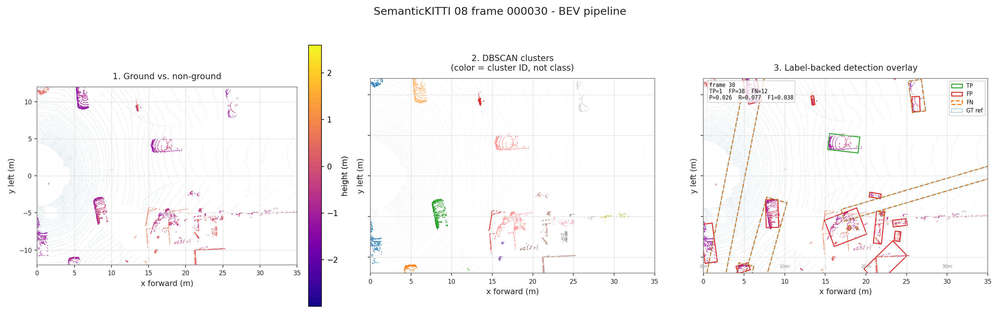
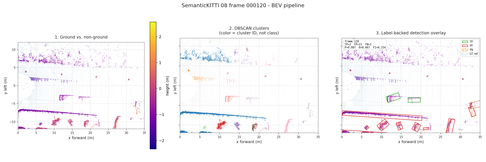
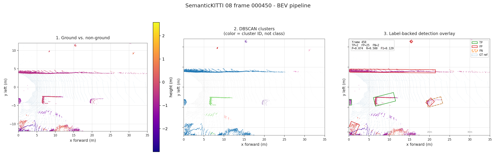

# KITTI / SemanticKITTI Sequence 08 Subset

This result is generated with `examples/kitti08_subset.yaml`.

## Protocol

- Dataset: KITTI Odometry / SemanticKITTI
- Sequence: `08`
- Frames: `0-499`
- Targets: `car`, `person`
- Matching: BEV IoU >= 0.5, class-aware
- Prediction class source: box-size heuristic when no class metadata exists
- Ground RANSAC seed: `0` (fixed for repeatable runs)
- Output: `outputs/kitti08_subset/reports/det_metrics.json`

## Overall Metrics

| Metric | Value |
| --- | ---: |
| Frames | 500 |
| Predictions | 14872 |
| Ground-truth boxes | 1937 |
| True positives | 563 |
| False positives | 14309 |
| False negatives | 1374 |
| Precision | 0.0379 |
| Recall | 0.2907 |
| F1 | 0.0670 |
| Mean IoU of matched boxes | 0.7223 |

## Distance Metrics

| Range | Predictions | GT | TP | FP | FN | Precision | Recall | F1 | Mean IoU |
| --- | ---: | ---: | ---: | ---: | ---: | ---: | ---: | ---: | ---: |
| 0-10m | 870 | 289 | 234 | 636 | 55 | 0.269 | 0.810 | 0.404 | 0.767 |
| 10-20m | 3626 | 578 | 243 | 3383 | 335 | 0.067 | 0.420 | 0.116 | 0.706 |
| 20-30m | 4219 | 495 | 58 | 4161 | 437 | 0.014 | 0.117 | 0.025 | 0.619 |
| 30-40m | 3718 | 325 | 18 | 3700 | 307 | 0.005 | 0.055 | 0.009 | 0.657 |
| 40-50m | 1901 | 250 | 10 | 1891 | 240 | 0.005 | 0.040 | 0.009 | 0.784 |

## Visual Checks

The images below use the same processing configuration as the measured subset.
`visualization.display_roi` crops only the rendered view. Panel 3 is derived
from real SemanticKITTI labels and the same class-aware BEV-IoU matching rule
as the table above; TP, FP, and FN are shown explicitly.

## Interpretation

This is a geometric proposal baseline. It is intentionally transparent but not
competitive with learned 3D detectors. The low precision is expected because the
pipeline treats many non-ground clusters as candidate objects and does not have
a learned objectness classifier. The matched-box IoU is more useful for judging
the box fitting stage: when the pipeline finds the right object, the oriented
box geometry is often plausible.
